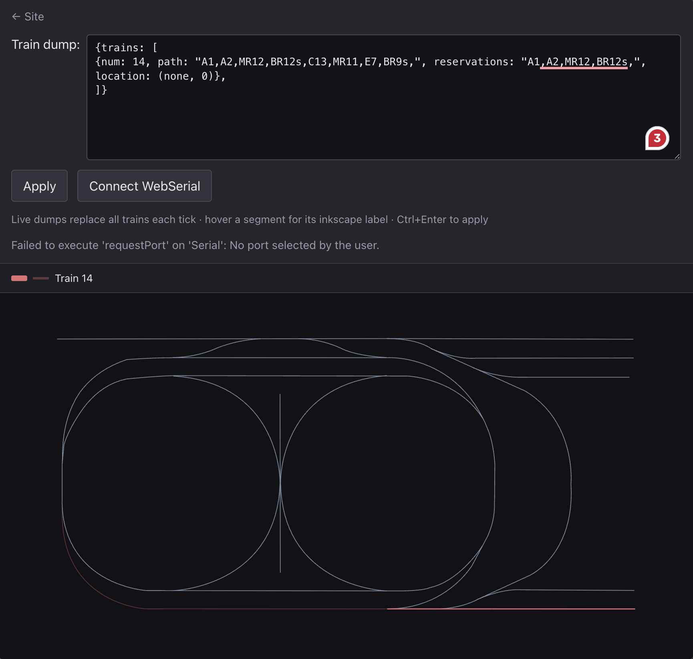

# Building the program

- `git clone git.uwaterloo.ca:akarmano/cs452-trains.git`
- `cd cs452-trains/kernel`
- `make -j12`
- `../upload.sh aaa.img <pi mac address>`

# Running TC2
- Use Track D
- We can confidently support 2 trains at a single time right now. 3+ trains fail due to inaccurate train localization which only becomes an issue with 3+ trains.

The following commands outline the quickest way to get started:

```bash
# enter the "trains" console
trains

# Register train 14
reg 14 <Sensor name (i.e., "A13")>

# run train 14 infinitely at speed 8
rt 14 5 8

# register train 17 and run infinitely at speed 8
reg 17 <Sensor name (i.e., "A10")>
rt 17 5 8


# running a third train works but not for very long due to localization issues
reg 15 <Sensor name (i.e., "A1")>
rt 15 5 8
````

## Tips:
- Reg stands for "register". It tells our model to expect the next sensor trigger of i.e., A1 to be from train 15. This is **very important** as it allows us to start tracking the train.
- Try to initially set trains near exits / deadends so that other trains have a lower chance of pathing to it. Also, try to start the rt ... cmd once there's a safe path for the train to get started.

## Visualizations:
https://ant52ho.github.io/#/track-map provides great visualizations of the track.



For visualizations to correctly display, be sure to click "Connect WebSerial" and select TTYS5